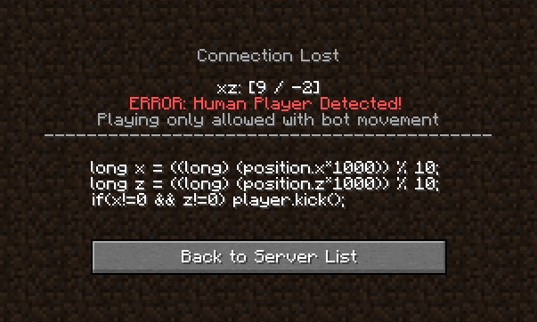

# Adventures in LiveOverflow - Minecraft

[[./Adventures_in_liveoverflow_companion.private]]

So, I've placed the IP in the private notes file (to avoid leaking it for
y'all), however there's still a challenge before being able to join



As you can see, there is some code to prevent you from being able to join if
you're a human

```java
long x = ((long) (position.x * 1000)) % 10;
long z = ((long) (position.z * 1000)) % 10;
if (x != 0 && z != 0) player.kick();
```

TODO: What we've got right now doesn't work, as I can't reflect properly when I
actually load it up in game-- could I construct a new packet with the new
position more easily?
