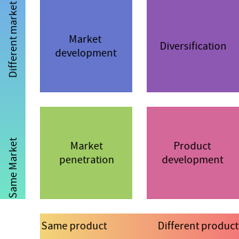

<!-- spell-checker:words Ansoff's -->

# Ansoff's matrix

- 4 quadrants, helps settling on a marketing direction
- Made by Igor Ansoff
- Lets you analyze strategic decisions based on risks and rewards

- Risk increases as you go more towards the different sides of the
  product/market axis
- It's generally going to require more market research to sell a different
  product or to a different market
- Some decisions might fit into more than 1 quadrant depending on your reasoning

  - If you're a brewery making a non-alcoholic drink you might be targeting
    people who don't drink at all, this would mean you're targeting a different
    market
  - On the other hand, perhaps you're targeting people who already drink your
    drinks but aren't able to drink alcohol at the time (i.e. they are the
    designated driver)

- Market penetration
  - Helps increase market share or grow demand for a product
  - Low risk, so lower costs
  - Can improve economies of scale
- Market development
  - Can require market research
  - Often geographical, but doesn't have to be (perhaps you are opening to a new
    market segment, such as age)
  - You know the product is good, and you already have expertise
  - You don't necessarily know the product will sell in a new market
- Product development
  - You can use this as an extension strategy (see the product lifecycle)
  - You already know the market, so it might be less likely to fail
- Diversification
  - A new product in a new market
  - Pretty risky as you don't have expertise in either the market or the product
  - However it does spread risk if it succeeds, for example Unilever wouldn't
    fail even if everyone stopped eating high-end ice-cream

## However

- It's an oversimplification
  - Apple knows customers will always buy a new iPhone, so there's very little
    risk
  - Slight tweaks to the product and the market would count as diversification
    but it isn't that risky (see "related diversification")
