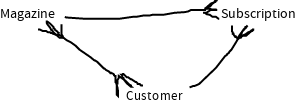

# Assessment 2 databases (corrections)

Note: *This needs to be combined with the test paper in order to produce a
"perfect test"*  
Note: *Responses to sections here overwrite responses on the test paper unless
otherwise specified. This should be "applied" with a recursive update, much like
`lib.attrsets.recursiveUpdate` in nix*

## Q1

### A

#### Importance

It reduces data duplication and avoids update anomalies

### B



### C

```sql
CREATE TABLE Magazine
(MagazineID int PRIMARY KEY NOT NULL,
MagazineName varchar(255),
Category varchar(255),
StartDate date,
EndDate date)
```

### E

```sql
UPDATE TABLE Magazine
SET MagazineName = "AQA Garden News"
WHERE MagazineName = "AQA Gardening Monthly"
```

## Q2

### D

Note: *This question should be merged differently, as in "like a diff"*

```diff
  looks at the destination IP and checks for the fastest next "hop" to send the packet to, decrementing
- the TTL by 1 and rewriting the mac address on the packet to specify that router as a destination. If
+ the TTL by 1 and rewriting the mac address on the packet to specify that
+ router as a destination. Routers are organized hierarchically, so a local
+ router will need to get it to a national router, which will send it on to an
+ international router, which will send it back to a national router in Belgium
+ and finally returning to local routers. If
  the TTL ever reaches 0, the packet will not be sent on and instead will be lost. The router that the
```
