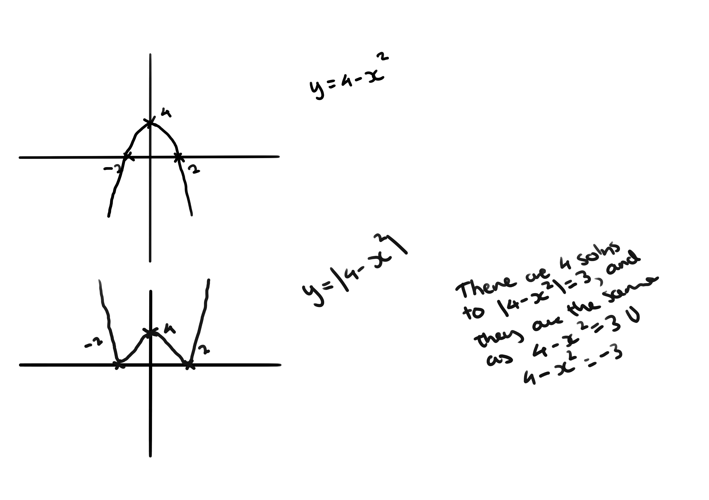

# Assignment U6DM2B

## Q1

### a

$\tan\alpha = \frac{3}{4}$  
$\alpha = 36.9\deg$

$R = \sqrt{3^2 + 4^2} = 5$  

$5\cos(x - 36.9\deg)$

### b

$5\cos(x - 36.9\deg) = 2$  
$\cos(x - 36.9\deg) = \frac{2}{5}$  

$x - 36.9\deg = \arccos\frac{2}{5}$  
$360\deg - (x - 36.9\deg) = \arccos\frac{2}{5}$  

$x = 103.3\deg$  
$x = 256.7\deg$  

All other solutions will be outside of the given range

### c

The minimum value will be -5, as the lowest cos can go is -1 and it is
multiplied by 5

$\cos(x - 36.9\deg) = -1$  
$x - 36.9\deg = 180\deg$  
$x = 216.9\deg$

## Q2

### a

the lowest the sin() function can output is -1, and it looks like it will at
some point by the numbers we're plugging into it

therefore the lowest value the equation can hold is $11.7 - 3.87$

7.83 hours

7 hours and 50 minutes (to nearest minute)

### b

This will happen when $14 - 11.87 < 3.87\sin(l)$ (where l is the stuff inside
the sin equation there)

$\sin > 0.5503876$  

### c

No, it's not appropriate. Sofia's graph has a lower variance of hours of
darkness, but the sin term is the non-constant one (i.e. the one that is causing
the variance), and increasing the absolute value of the coefficient will
increase the bearing it has on the result, increasing the variance as a whole.
Sofia instead needs to lower the 3.87 value (and potentially apply some tweaks
to the constant term)

## Q3

### B

#### ii

$4 - x^2 = 3$  
$-x^2 = -1$  
$x^2 = 1$  
$x = \pm 1$  

$4 - x^2 = -3$  
$-x^2 = -7$  
$x^2 = 7$  
$x = \pm\sqrt7$  

$\pm 1$ and $\pm\sqrt7$

#### iii

$-\sqrt7 < x < -1$ and $\sqrt7 > x >1$

## Q4

Proving by contradiction, so...

- Assume that $\sqrt[3]{2}$ is rational
- $\therefore$ you can write it as $\frac{a}{b}$, $(a, b) \in (\mathbb{Z}^+ \cup \{0\},
  \mathbb{Z}^+)$ where $a$ and $b$ are coprime
- $\implies \frac{a^3}{b^3} = 2$
- $\implies a^3 = 2b^3$
- $\therefore b^3$ must be even, as it is 2 times something
- $\therefore b$ must be even, as 3 odd numbers multiplied can never be even
- $\therefore a^3$ must be even, as it is equal to something that is 2 times
  something
- $\therefore a$ must be even, as 3 odd numbers multiplied can never be even
- But **a and b must be coprime**, so we have a contradiction
- $\therefore$ one of our assumptions must be false. As we only made 1
  assumption (that $\sqrt[3]{2}$ is rational) it must be the incorrect
  assumption
- $\therefore \sqrt[3]{2}$ is irrational

## Q5

$200 - 122 = 78$ houses that regularly purchase either Indian or Chinese  
Ratio of houses that purchase just Chinese to both is $9:1$  
Ratio of houses that purchase just Indian to both is $3:1$  
Ratio of houses that purchase chinese to indian to both is $9:3:1$  
Total = $13$  
$78 / 13 = 6$  
6 houses regularly purchase both Chinese and Indian, therefore the probability
is $6 / 200$ or $3\%$

## Q6

### a

$z = \frac{x - \mu}{\sigma}$  
For $X\sim N(0, 1), P(X\le2.0537) = 0.98$  
$2.0537 = \frac{45 - \mu}{\sigma}$  
$45 - \mu = 2.0537\sigma$  

### b

For $X\sim N(0, 1), P(X>-1.6449) = 0.95$  
$-1.6449 = \frac{30 - \mu}{\sigma}$  
$-1.6449\sigma = 30 - \mu$  

$45 - 30 = (2.0537 + 1.6449)\sigma$  
$15 = 3.6986\sigma$  
$\sigma = 4.055588601$

$45 - \mu = 2.0537 * 4.055588601$  
$45 - \mu = 8.32896231$  
$\mu = 45 - 8.32896231$  
$\mu = 36.67103769$  

$X\sim N(4.1^2, 36.7)$

