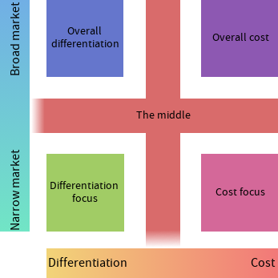

# Porter's generic strategy model

<!-- spell-checker:words trailblaze -->

- There are 2 types of companies by this model
  - Low cost operators
  - Differentiating businesses
- You can also be stuck in the middle

- This principle applies _generically_, i.e. not depending on the industry

| Low-cost operators                 | Differentiating businesses     |
| ---------------------------------- | ------------------------------ |
| Charges the lowest prices          | Provides the best advantages   |
| Choosing cheapest suppliers        | Using high-quality materials   |
| Focus on the core product          | Has one or more USPs           |
| Ecommerce to reduce premises costs | High customer loyalty          |
| Focus on waste reduction           | R & D to trailblaze innovation |
| High capacity utilization          | High investment in brand image |
| Capital intensive                  | Highly-trained employees       |
| Flexible workforce                 | Good customer service          |
|                                    | A focus on customer experience |

- If you're in the middle of these, customers do not have a reason to trade with
  you
  - You're providing a subpar service
  - You're not super cheap
  - You're just mediocrity

We can also apply this model narrowly or broadly, making a matrix

|                 | Broad                   | Narrow                |
| --------------- | ----------------------- | --------------------- |
| Costs           | Overall cost            | Cost focus            |
| Differentiation | Overall differentiation | Differentiation focus |

- Overall cost means becoming the lowest cost provider
- Overall differentiation means providing something unique, such as a good USP,
  a wider distribution or a better quality
- Cost focus is reducing cost for a niche market segment, for example Aldi
  focuses on reducing costs for very popular supermarket items, or Rolls Royce
  reducing costs... for those who are buying expensive sports cars
- Differentiation focus is differentiation in a niche market segment. An example
  is Riverford vegetable boxes, which deliver fresh fruit and vegetables to
  customers for premium prices. They differentiate themselves by having
  everything organically grown in the UK, although they are already in a very
  niche market

Putting it all together, here's Porter's generic strategy model with the middle
marked on

