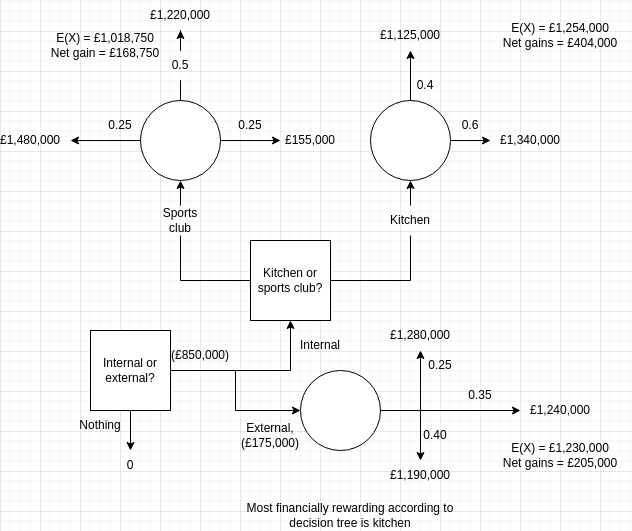

# Theme 3 study guide pages 127-130

## Q4

Completed in-lesson

## Calculation sheet

### Q1

Calculating $E(X)$...  
Germany: $0.75 * 24 + 0.25 * 4 = £19$  
US East: $0.45 * 44 + 0.55 * -8 = £15.4$  
Spain: $0.55 * 32 + 0.45 * 4 = £19.4$  
US West: $0.5 * 37.50 + 0.5 * 6 = £21.75$

Calculating net gain...
Germany: $19 - 15 = £4mn$  
US East: $15.4 - 22 = -£6.6mn$  
Spain: $19.4 - 15 = £4.4mn$  
US West: $21.75 - 22 = -£0.25$

Don't invest in the US

### Q2

## Advantages and limitations of decision trees

Covered in another document: [[./Pros_and_cons_of_decision_trees_20221017.md]]

## Tutor2u worksheet

### Q1

- Decisions
- Campaign
- Locate
- Nodes
- Outcomes
- Probabilities
- Value
- Right

### Q2

- False
- True
- False
- True

### Q3

1. Despite financial factors being important, otber things than finance are too,
   for example how ethical a business decision is. Quantitative factors can't
   tell you how ethical a decision is, demonstrating that they do miss some
   important detail.

2. Middle managers may want to construct a decision tree to see what their
   expectation for a return is on an investment. This will let them know how
   worth it each decision they could make is, taking into account outcomes that
   they may not be certain about yet.

3. Unexpected factors, such as new legislation or, say, a pandemic, could make
   different events more likely or less likely to happen, changing the
   probabilities of different events and invalidating the data

### Q4

Sell potatoes: $E(X) = 36,000$  
Make vodka: $E(X) = 26,000, net = 16,000$  
Make crisps: $E(X) = 65,000, net = 45,000$  

#### 4.1

Martin should make crisps

#### 4.2

If this fails (a 50% chance!) martin will actually end up losing $10,000$, which
he may not be able to comfortably afford
